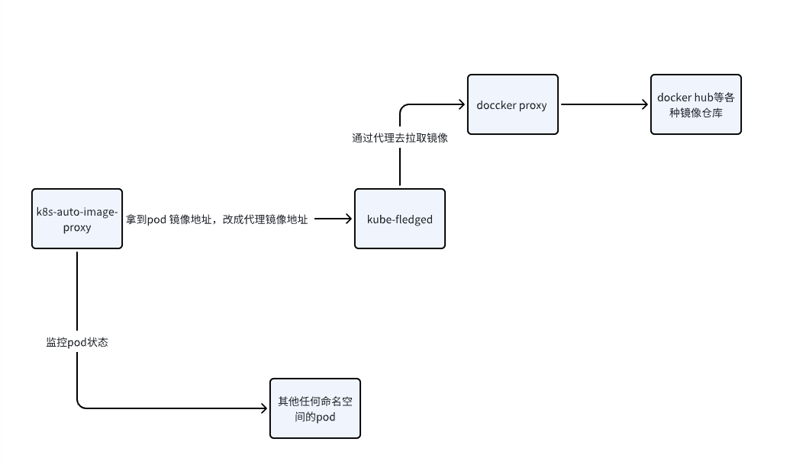

# k8s集群内docker镜像自动拉取工具

## 背景

内网集群内部署应用时，由于众所周知的原因，镜像无法拉取到docker镜像，或者拉取速度很慢。

以往尝试过的解决方案：
1. 预先通过工具，在每个节点提前拉取好镜像
2. 比第一条更进一步，通过其他方式将docker镜像拉取到内网或者加速镜像仓库，批量修改yaml或者chart中的镜像地址为内网或者加速镜像仓库
3. 每个k8s节点上设置代理，通过代理去拉取镜像

以上的解决方案，要么需要额外的运维操作比较麻烦（比如提前脚本拉取，推送仓库啥的），要么是比较有侵入性（比如设置代理，代理挂掉也会影响其他正常的镜像拉取）

为此，实现了一个简单的工具，用于在k8s集群内部署应用时，能够自动拉取那些，拉取失败的镜像。


## 概述
如图所示



此项目实现了这么一个服务，会监听pod的状态，一旦识别到其发生了镜像拉取失败之类的错误，会先替换镜像为代理镜像地址，然后创建crd任到kube-fledged，kube-fledged会去拉取镜像，拉取成功之后，会将镜像地址替换为原来的地址。

kube-fledged是一个镜像预热工具，常用于在应用部署之前，提前拉取镜像，以加速应用部署。这里我们是将他用在了应用部署之后，进行镜像拉取失败的镜像的拉取。
[https://github.com/DaoCloud/crproxy](https://github.com/DaoCloud/crproxy)

## 部署

### 使用互联网上的镜像代理

*找一台有k8s权限的机器，假设kubeconfig文件在~/.kube/config*

推荐使用DaoCloud提供的免费镜像代理

[public-image-mirror](https://github.com/DaoCloud/public-image-mirror)

修改docker-compose.yaml文件中的environment

环境变量说明:

| 环境变量 | 说明 | 默认值 | 是否必填
| --- | --- | --- | -- |
| DOCKER_PROXY_URL | 代理地址 | 无 | 是
| NO_PROXY_DOCKER_DOMAIN | 不需要代理的域名，比如公司的内网域名等，逗号分隔 |  | 否
| KUBE_FLEDGED_NAMESPACE | kube-fledged的namespace | kube-fledged | 是
| IMAGE_CHECK_INTERVAL | 检查pod状态的间隔（秒） | 10 | 否

在使用DaoCloud的镜像代理的情况下，最简示例如下:
```yaml
version: '3.8'

services:
  k8s-docker-proxy:
    build:
      context: .
      dockerfile: Dockerfile
    volumes:
      - ~/.kube:/root/.kube
    environment:
      DOCKER_PROXY_URL: "m.daocloud.io"
```


修改后，还需要部署依赖的[kube-fledged](https://github.com/senthilrch/kube-fledged)组件，这个组件用于拉取镜像

```shell
git clone https://github.com/senthilrch/kube-fledged.git

# 项目提供了多种部署方式，这里使用最简单的部署方式
make deploy-using-yaml
```

> 如果连这个项目的镜像也拉去不下来，手动修改deploy/kubefledged-deployment-controller.yaml deploy/kubefledged-deployment-webhook-server.yaml的镜像地址,为其添加镜像地址的前缀即可（如senthilrch/kubefledged-controller -> m.daocloud.io/docker.io/senthilrch/kubefledged-controller），并再次执行make。

操作完成后，启动容器运行

```shell
docker-compose up -d
```

如果容器运行后没有error日志输出，说明部署成功


当存在镜像拉取失败的pods时，会有如下日志输出
```txt
k8s-docker-proxy_1  | 2024-08-07 23:47:13,220 - INFO - ImageCache created: imagecache-node-game14
k8s-docker-proxy_1  | 2024-08-07 23:47:48,371 - INFO - handle pod apisix-dashboard-6c885b7886-w9mrs, pod.metadata.name='apisix-dashboard-6c885b7886-w9mrs', pod.metadata.namespace='apisix', reason='ErrImagePull',image='apache/apisix-dashboard:2.13-alpine', nodename='node01'
k8s-docker-proxy_1  | 2024-08-07 23:47:50,413 - INFO - commit pull task, node='node01', images={'m.daocloud.io/docker.io/apache/apisix-dashboard:2.13-alpine'}
```

可以在kube-fledged的namespace中检查，会有对应的拉取job创建出来

### 使用自建镜像代理

待补充